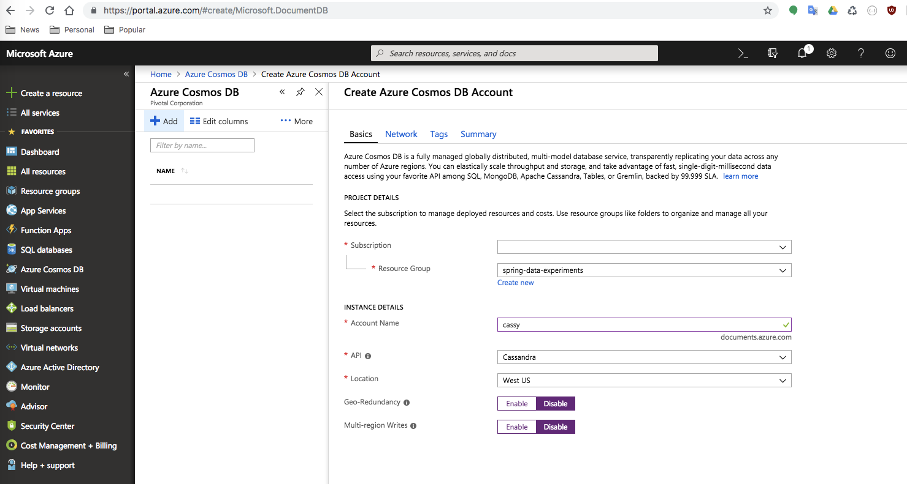

# Reactive Cassandra Example

This project explores the [Reactive Cassandra Support](https://docs.spring.io/spring-data/cassandra/docs/2.1.0.RELEASE/reference/html/#cassandra.reactive) in [Spring Data Cassandra](https://spring.io/projects/spring-data-cassandra), specifically: how to implement a [reactive repository](https://docs.spring.io/spring-data/cassandra/docs/2.1.0.RELEASE/reference/html/#cassandra.reactive.repositories), author integration tests, configuring the app to run locally against a [Docker image](https://hub.docker.com/r/bitnami/cassandra/) of Cassandra, and deploying the app to [Pivotal Application Service](https://pivotal.io/platform/pivotal-application-service) interacting with an Azure CosmosDB instance via the [Cassandra API](https://docs.microsoft.com/en-us/azure/cosmos-db/cassandra-introduction).


## Prerequisites

* An account with [Space Developer role](https://docs.cloudfoundry.org/concepts/roles.html#roles) access on a Cloud Foundry foundation, e.g., [Pivotal Web Services](https://run.pivotal.io)
* An [account](https://azure.microsoft.com/free/) on Microsoft [Azure](https://azure.microsoft.com/)
* [Azure CLI](https://docs.microsoft.com/en-us/cli/azure/install-azure-cli?view=azure-cli-latest) 2.0.46 or better
* [CF CLI](https://github.com/cloudfoundry/cli#downloads) 6.40.0 or better if you want to push the application to a Cloud Foundry (CF) instance
* [httpie](https://httpie.org/#installation) 0.9.9 or better to simplify interaction with API endpoints
* Java [JDK](https://openjdk.java.net/install/) 1.8u172 or better to compile and run the code
* [Gradle](https://gradle.org/releases/) 4.8.1 or better to build and package source code
* Docker for [Mac](https://store.docker.com/editions/community/docker-ce-desktop-mac) or [Windows](https://store.docker.com/editions/community/docker-ce-desktop-windows) for spinning up a local instance of Cassandra and [cassandra-web](https://hub.docker.com/r/metavige/cassandra-web/) (an administration interface)
* [cqlsh](http://cassandra.apache.org/doc/4.0/tools/cqlsh.html) the CQL shell 
	* on a Mac it's easy to install w/ [Homebrew](https://brew.sh) using `brew install cassandra`


## Clone

```
git clone https://github.com/pacphi/reactive-cassy.git
```


## Build

Build this project with Gradle


```bash
gradle clean build
```

If you're on a Mac you will want to execute the following (once) 

```bash
./install.sigar.macos.sh
```

and then

```
gradle clean build -Djava.library.path=$JAVA_LIBRARY_PATH:~/Library/Java/Extensions:/Library/Java/Extensions:/Network/Library/Java/Extensions:/System/Library/Java/Extensions:/usr/lib/java:. -Ddebug
```

## Prepare

To run the project, need to run below `cql` commands on Cassandra.

### Connect to a Cassandra instance

We'll explore two options

#### Docker hosted

Start the server

```
docker run -d --name cassandra-server \
    --network app-tier \
    bitnami/cassandra:latest
```

Connect via cqlsh

```
docker run -it --rm \
    --network app-tier \
    bitnami/cassandra:latest cqlsh --username cassandra --password cassandra cassandra-server
```

If you want to access the server from the host machine where you have `cqlsh` already installed, you could start it with 

```
docker run -d -p 9042:9042 -e CASSANDRA_HOST=127.0.0.1 \
    --name cassandra-server \
    --network app-tier \
    bitnami/cassandra:latest
```

then

```
cqlsh -u cassandra -p cassandra
```

#### Azure hosted CosmosDB

Fire up a browser and [login](http://portal.azure.com) to the Azure portal

Also launch a [Terminal](https://macpaw.com/how-to/use-terminal-on-mac) session, set your subscription account and create a new resource group, e.g.,

```
az login
az account set --subscription 90c2a5c6-0aef-963d-b153-f44d21402d98
az group create --name spring-data-experiments --location westus
```

> Replace values for `--subscription`, `--name`, and `--location` above with your own.

Visit the Azure portal in your browser, navigate to `Azure Cosmos DB`, and add a new instance



Visit your new instance's `Settings > Connection String` and make a note of the: `contact point`, `port`, `username` and `primary password`.

Then connect (on a Mac) with, e.g.,

```
export SSL_VERSION=TLSv1_2 
export SSL_VALIDATE=false 
cqlsh cassy.cassandra.cosmosdb.azure.com 10350 -u cassy -p XJuTjJZLHaAVcAqrVYH4aVu6lhfDk9vOMJ9ePHosv3p4Tpa19N0ZBydmpDtBwpnaaMQeGLzBvKCD7ObEjGXgTU== --ssl
```

> Replace the last line above with your own instance's connection details, like `cqlsh {contact point} {port} -u {username} -p {primary password} --ssl`


### Keyspace Creation

Once connected we need to create a keyspace

```bash
CREATE KEYSPACE IF NOT EXISTS customers WITH replication = {'class': 'SimpleStrategy', 'replication_factor': '3' };
```

### Table Creation

Let's create a table and indexes

```
USE customers;
CREATE TABLE customer (id TimeUUID PRIMARY KEY, firstname text, lastname text);
CREATE INDEX customerfirstnameindex ON customer (firstname);
CREATE INDEX customerlastnameindex ON customer (lastname);
```

> As of 2018-10-13 Azure Cosmos DB does not yet support `CREATE INDEX`; therefore, skip executing the last two lines above when connected to a Cosmos DB instance


## Run 

To startup the application, execute

### Simple case 

We'll fire up a local Docker instance of Cassandra, execute the [Keyspace](#keyspace-creation) and [Table](#table-creation) creation steps above, then start the application 

```bash
docker run -d -p 9042:9042 -e CASSANDRA_HOST=127.0.0.1 \
    --name cassandra-server \
    --network app-tier \
    bitnami/cassandra:latest
gradle bootRun -Dspring.profiles.active=docker
```

### with Docker Compose

// TODO

### with Kubernetes

// TODO


## How to deploy to Pivotal Application Service

These instructions assume that a Cassandra instance is available and was pre-provisioned "off-platform" (e.g., on PKS or Azure Cosmos DB).

### Authenticating

Authenticate to a foundation using the API endpoint. 
> E.g., login to [Pivotal Web Services](https://run.pivotal.io)

```
cf login -a https:// api.run.pivotal.io
```

### Managing secrets

Place secrets in `config/secrets.json`, e.g.,

```
{
	"CONTACT_POINT" : "xxxxx",
	"PORT" : xxxxx,
	"USERNAME" : "xxxxx",
	"PASSWORD" : "xxxxx"
}
```

We'll use this file later as input configuration for the creation of either a [credhub](https://docs.pivotal.io/credhub-service-broker/using.html) or [user-provided](https://docs.cloudfoundry.org/devguide/services/user-provided.html#credentials) service instance.

> Replace occurrences of `xxxxx` above with appropriate values

### Deploy and shutdown

Deploy the app (w/ a user-provided service instance vending secrets)

```
./deploy.sh
```

Deploy the app (w/ a Credhub service instance vending secrets)

```
./deploy.sh --with-credhub
```

Shutdown and destroy the app and service instances

```
./destroy.sh
```


## Endpoints

Current implementation supports

### POST /customers

```
http POST {host}:{port}/customers firstName=Nick lastName=Fury
```

### PUT /customers/{id}

```
http PUT {host}:{port}/customers/f91116f0-cf20-11e8-b999-7fb395277057 firstName=Nick lastName=Gone
```

### GET /customers/{id}

```
http {host}:{port}/customers/f91116f0-cf20-11e8-b999-7fb395277057
```

### GET /customers?lastName={lastName}&firstName={firstName}

```
http {host}:{port}/customers?lastName=Gone
http {host}:{port}/customers?firstName=Nick
http {host}:{port}/customers?lastName=Gone&firstName=Nick
```

### GET /stream/customers

```
http {host}:{port}/stream/customers
```

### DELETE /customers/{id}

```
http DELETE {host}:{port}/customers/f91116f0-cf20-11e8-b999-7fb395277057
```


## Credits and further reading

To those who've blazed trails...

* [Building REST services with Spring](https://spring.io/guides/tutorials/rest/)
* [Spring Data for Cassandra - Reference Documentation](https://docs.spring.io/spring-data/cassandra/docs/2.0.5.RELEASE/reference/html/)
* [Cassandra with Java](https://www.baeldung.com/cassandra-with-java)
* [Cannot execute this query as it might involve data filtering](https://medium.com/@sameira/spring-data-cassandra-cannot-execute-this-query-as-it-might-involve-data-filtering-377cb5afda68)
* [Reactive Streams with Spring Data Cassandra](https://dzone.com/articles/reactive-streams-with-spring-data-cassandra)
* [Spring Data Cassandra 2.0 - Reactive examples](https://github.com/spring-projects/spring-data-examples/tree/master/cassandra/reactive)
* [Spring HATEOAS - API Evolution Example](https://github.com/spring-projects/spring-hateoas-examples/tree/master/api-evolution)
* [Introduction to the Azure Cosmos DB Cassandra API](https://docs.microsoft.com/en-us/azure/cosmos-db/cassandra-introduction)
